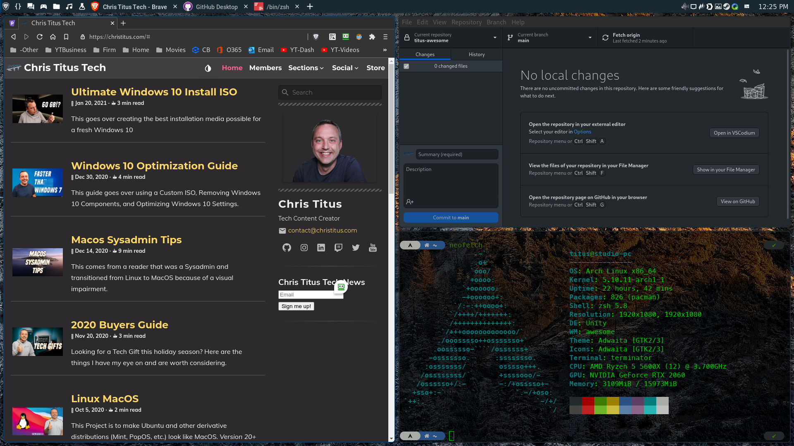
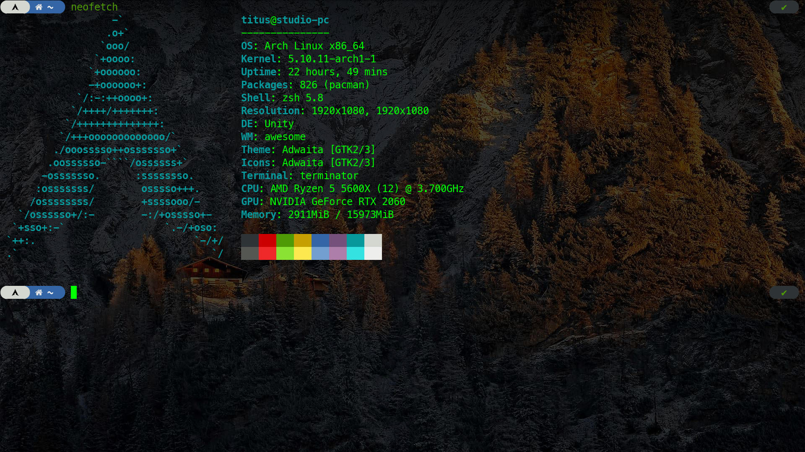
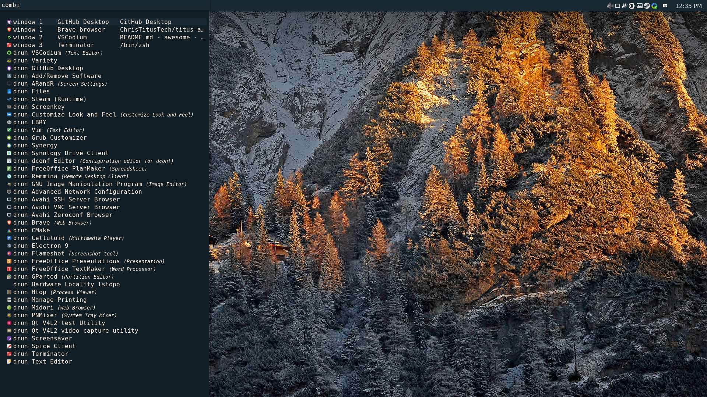

## Material and Mouse driven theme for [AwesomeWM 4.3](https://awesomewm.org/)
### Original design by PapyElGringo, I modified it removing sidebar and condensing the bars to a single top panel. 

Note: This fork focuses on streamlining the config and adding some Quality of Life touches to the theme.

An almost desktop environment made with [AwesomeWM](https://awesomewm.org/) following the [Material Design guidelines](https://material.io) with a performant opiniated mouse/keyboard workflow to increase daily productivity and comfort.

[](https://www.reddit.com/r/unixporn/comments/anp51q/awesome_material_awesome_workflow/)
*[Click to view in high quality](https://www.reddit.com/r/unixporn/comments/anp51q/awesome_material_awesome_workflow/)*

| Fullscreen   | Rofi Combo Panel | Exit screen   |
|:-------------:|:-------------:|:-------------:|
||||

## Installation

- Walkthrough available here: [How to Make a Custom Linux Desktop | My AwesomeWM Theme](https://www.youtube.com/watch?v=1QQps1qTgG4)

### 1) Get all the dependencies

#### Debian-Based

```
sudo apt install awesome fonts-roboto rofi compton i3lock xclip policykit-1-gnome materia-gtk-theme papirus-icon-theme lxappearance xbacklight flameshot pnmixer network-manager-gnome xfce4-power-manager qt5-style-plugins -y
```

Note: Debian-Based users have to install Capitaine cursors manually.

#### Arch-Based

```
yay -S awesome ttf-roboto rofi picom i3lock-fancy-git xclip polkit-gnome materia-theme papirus-icon-theme capitaine-cursors lxappearance xorg-xbacklight flameshot pnmixer network-manager-applet xfce4-power-manager qt5-styleplugins -y
```

#### Program list

- [AwesomeWM](https://awesomewm.org/) as the window manager - universal install: awesome
- [Roboto](https://fonts.google.com/specimen/Roboto) as the **font** - Debian: fonts-roboto Arch: ttf-roboto
- [Rofi](https://github.com/DaveDavenport/rofi) for the app launcher - universal install: rofi
- [picom](https://github.com/yshui/picom) for the compositor (blur and animations) - universal install: picom - Debian users need PPA (`sudo add-apt-repository ppa:regolith-linux/unstable`) _Note: I recommend Compton for Debian Users and the Debian Branch_
- [i3lock](https://github.com/meskarune/i3lock-fancy) the lockscreen application - universal install: i3lock-fancy
- [xclip](https://github.com/astrand/xclip) for copying screenshots to clipboard - universal install: xclip
- [polkit-gnome](https://download.gnome.org/sources/polkit-gnome) recommended using the GNOME polkit as it integrates nicely for elevating programs that need root access - Debian: policykit-1-gnome Arch: polkit-gnome
- [Materia](https://github.com/nana-4/materia-theme) as **GTK** theme - Debian: materia-gtk-theme Arch: materia-theme
- [Papirus Dark](https://github.com/PapirusDevelopmentTeam/papirus-icon-theme) as **icon** theme - universal install: papirus-icon-theme
- [Capitaine cursors](https://github.com/keeferrourke/capitaine-cursors) as **cursor** theme - Debian: manual install Arch: capitaine-cursors
- [lxappearance](https://sourceforge.net/projects/lxde/files/LXAppearance/) to set up the **GTK**, **icon** and **cursor** themes - universal install: lxappearance
- (Laptop) [xbacklight](https://www.x.org/archive/X11R7.5/doc/man/man1/xbacklight.1.html) for adjusting brightness on laptops (disabled by default) - Debian: xbacklight Arch: xorg-xbacklight
- [flameshot](https://flameshot.org/) my personal screenshot utility of choice, can be replaced by whichever you want, just remember to edit the apps.lua file - universal install: flameshot
- [pnmixer](https://github.com/nicklan/pnmixer) audio tray icon that is in Debian repositories and is easily installed on Arch through AUR - universal install: pnmixer
- [network-manager-applet](https://gitlab.gnome.org/GNOME/network-manager-applet) network manager tray icon from GNOME - Debian: network-manager-gnome Arch: network-manager-applet
- [xfce4-power-manager](https://docs.xfce.org/xfce/xfce4-power-manager/start) Xfce's power manager is excellent and a great way of dealing with sleep, monitor timeout and other power management features - universal install: xfce4-power-manager

### 2) Clone the configuration

#### Debian-Based

```
git clone --branch debian https://github.com/ChrisTitusTech/titus-awesome ~/.config/awesome
```

#### Arch-Based

```
git clone https://github.com/ChrisTitusTech/titus-awesome ~/.config/awesome
```

### 3) Set the themes

Start `lxappearance` to activate the **GTK**, **icon** and **cursor** themes.
Note: for **cursor** theme, edit `~/.icons/default/index.theme` and `~/.config/gtk3-0/settings.ini` aswell, copy the 2 files over to their respective place in `/root` for the change to also show up in applications ran as root.

Set Rofi theme:

```
mkdir -p ~/.config/rofi
cp $HOME/.config/awesome/theme/config.rasi ~/.config/rofi/config.rasi
sed -i '/@import/c\@import "'$HOME'/.config/awesome/theme/sidebar.rasi"' ~/.config/rofi/config.rasi
```

### 4) Same theme for Qt and GTK applications and fix missing indicators

Add this to the bottom of your `/etc/environment`:

```
XDG_CURRENT_DESKTOP=Unity
QT_QPA_PLATFORMTHEME=gtk2
```

The first variable fixes most indicators (especially electron based ones!), the second tells Qt applications to use your GTK2 theme set through lxappearance.

### 5) Read the documentation

The documentation lives within the source code.

The project is split in functional directories and in each of them is a readme file where you can get additional information about them.

* [Configuration](./configuration) is about all the **settings** available
* [Layout](./layout) holds the **disposition** of all the widgets
* [Module](./module) contains all the **features** available
* [Theme](./theme) holds all the **aesthetic** aspects
* [Widget](./widget) contains all the **widgets** available
